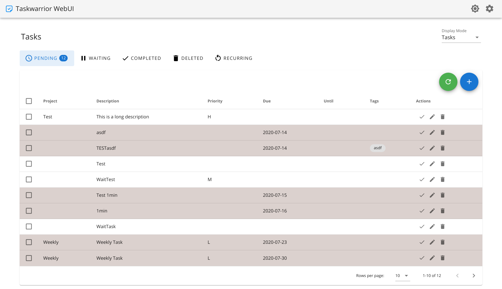
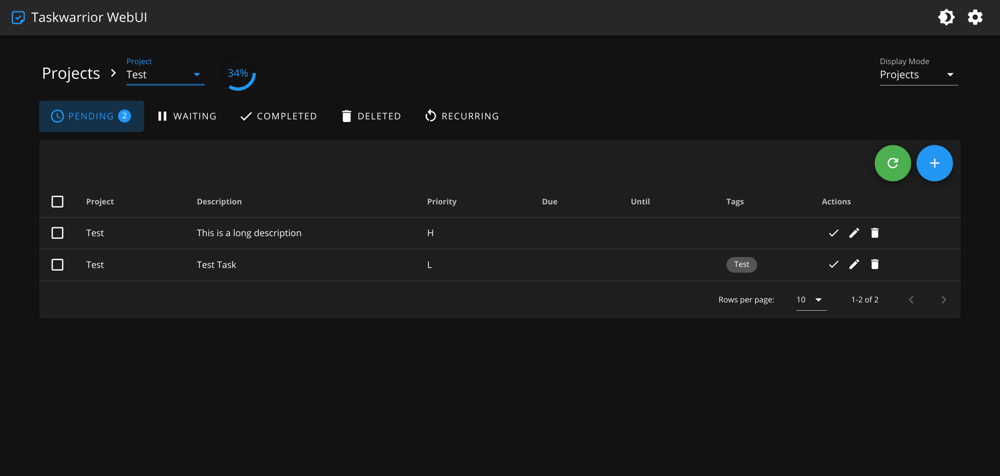

# Taskwarrior-webui

[](https://hub.docker.com/r/dcsunset/taskwarrior-webui)

Responsive Web UI for Taskwarrior based on Vue.js and Koa.js.

## Screenshots





## Features

* Responsive layouts
* Material Design UI
* PWA support
* Easy to deploy (using Docker)
* Support for multiple types of tasks
* Support for light and dark themes
* Sync with a taskserver


## Deployment

### Using docker (recommended)

First pull the docker image:

```
docker pull dcsunset/taskwarrior-webui
```

Then run it with the command:

```
docker run -d -p 8080:80 --name taskwarrior-webui \
	-v $HOME/.taskrc:/.taskrc -v $HOME/.task:/.task \
	dcsunset/taskwarrior-webui
```
Enter `http://127.0.0.1:8080` (replace `127.0.0.1` with your ip address if running on a remote server).

If you want to use already existing taskwarrior data, use `:z` or `:Z` labels. See
[here](https://stackoverflow.com/questions/35218194/what-is-z-flag-in-docker-containers-volumes-from-option/35222815#35222815).
```
# e.g.
docker run -d -p 8080:80 --name taskwarrior-webui \
	-v $HOME/.taskrc:/.taskrc:z -v $HOME/.task:/.task:z \
	dcsunset/taskwarrior-webui
```

If your configuration file contains absolute path to your home directory like `/home/xxx/ca.cert.pem`,
you may want to mount files to the same paths in the container using the following command:

```sh
docker run -d -p 8080:80 --name taskwarrior-webui \
	-e TASKRC=$HOME/.taskrc -e TASKDATA=$HOME/.task \
	-v $HOME/.taskrc:$HOME/.taskrc -v $HOME/.task:$HOME/.task \
	dcsunset/taskwarrior-webui
```

## Configurations

The following environment variables may be set:
 * `TASKRC` - the location of the `.taskrc` file, `/.taskrc` by default when run in _production_ mode
 * `TASKDATA` - the location of the `.task` directory, `/.task` by default when run in _production_ mode

Remember to mount your files to **the corresponding locations** when you set `TASKRC` or `TASKDATA` to a different value.

### Manually deploy

First build the frontend:

```
cd frontend
npm install
npm run build
npm run export
```

Then build and start the backend:

```
cd backend
npm install
npm run build
npm start
```

Then install nginx or other web servers
to server frontend and proxy requests to backend
(you can refer to `nginx/nginx.conf`).

## Development

First start the server at backend:

```
cd backend
npm install
npm run dev
```

Then start the dev server at frontend:

```
cd frontend
npm install
npm run dev
```

Then the frontend will listen at port 8080.

## Contributing

Contributions are very welcome!
Please create or comment on an issue to discuss your ideas first before working on any PR.

I've been very busy recently and may not be able to handle every issue timely.
So I'm also looking for maintainers who are interested in this project.
Feel free to open an issue if you have any interest.

## FAQ

### Sync with a taskserver

This Web UI supports auto sync with a taskd server
by calling the `task sync` command periodically.
In order to use this function,
first you need to follow the [instructions](https://taskwarrior.org/docs/taskserver/setup.html)
to configure both the taskserver and client manually until the `task sync` can be executed successfully.
Then remember to map the client configurations (`.taskrc` and `.task`) into the container.

### Authentication

Though authentication is not supported directly,
it is possible to use basic auth by configuring nginx (or you can even use your own reverse-proxy to do it).

For example, you can modify the file `nginx/server.conf` as below:

```nginx
server {
  listen 80;
  listen [::]:80;

  # add auth
  auth_basic           "Protected page";
  auth_basic_user_file /etc/htpasswd;

  # remaining part unchanged
  ...
}
```

Then mount the file and `htpasswd` file:

```shell
docker run -d -p 8080:80 --name taskwarrior-webui \
	-v $HOME/.taskrc:/.taskrc -v $HOME/.task:/.task \
    -v $PWD/server.conf:/etc/nginx/conf.d/default.conf \
    -v $PWD/htpasswd:/etc/htpasswd \
	dcsunset/taskwarrior-webui
```

## License

GPL-3.0 License
